# ⚡ HIMANSHU GANDHI
### `cloud_architect.exe --mode=innovation --location=toronto`

```ascii
    ╭─────────────────────────────────────────────────╮
    │  🚀 TRANSFORMING IDEAS INTO CLOUD REALITY       │
    │  ☁️  Multi-Cloud Solutions Architect            │
    │  🎯 DevOps Automation Specialist                │
    │  📊 Agile Delivery Expert                       │
    ╰─────────────────────────────────────────────────╯
```

---

## 🧬 **SYSTEM OVERVIEW**
```yaml
human:
  name: "Himanshu Gandhi"
  role: "Cloud Solutions Architect"
  location: "Toronto, Canada 🇨🇦"
  mode: "Remote | Hybrid | On-site"
  status: "🟢 Available for opportunities"
  
education:
  current: "Cloud Computing PG @ George Brown College"
  certified: "Project Management @ Fleming College"
  
mission: |
  Building tomorrow's infrastructure today through 
  intelligent automation and scalable cloud solutions
```

---

## ⚡ **CURRENT OPERATIONS**

<table>
<tr>
<td width="50%">

### 🔥 **ACTIVE PROJECTS**
```bash
$ kubectl get projects --namespace=himanshu
NAME                    STATUS    AGE
azure-cloud-native     Running   90d
terraform-iac          Running   45d
devops-pipeline        Running   30d
k8s-microservices      Running   15d
```

</td>
<td width="50%">

### 🎯 **SKILL ACQUISITION**
```python
learning_queue = [
    "AWS Solutions Architect Pro",
    "Azure DevOps Engineer Expert", 
    "Kubernetes CKA Certification",
    "Cloud Security & Compliance"
]
progress = "██████████░░" # 83% complete
```

</td>
</tr>
</table>

---

## 🛠️ **TECHNOLOGY STACK**

### **☁️ Cloud Platforms**


### **🔧 DevOps & Infrastructure**


### **💻 Development**


### **🗄️ Data & Storage**


---

## 📊 **SYSTEM METRICS**

<div align="center">

### **⚡ Performance Dashboard**


### **🔥 Contribution Heatmap**


### **🏆 Achievement Unlocked**


</div>

---

## 🌐 **NETWORK CONNECTIONS**

```mermaid
graph LR
    A[📧 Email] --> H[👨‍💻 Himanshu]
    B[💼 LinkedIn] --> H
    C[🌐 Portfolio] --> H
    D[📱 GitHub] --> H
    
    H --> E[☁️ Cloud Solutions]
    H --> F[🚀 DevOps Magic]
    H --> G[📊 Project Success]
    
    style H fill:#00D4FF,stroke:#30A3DC,stroke-width:3px
```

<div align="center">



**📫 Establish Connection:**
- 🚀 **Email**: [gandhi111000@hotmail.com](mailto:gandhi111000@hotmail.com)
- 💼 **LinkedIn**: [Connect with me](https://www.linkedin.com/in/himanshu-gandhi3024)
- 🌐 **Portfolio**: Coming Soon™
- 👨‍💻 **GitHub**: You're already here!

</div>

---

## 💭 **SYSTEM PHILOSOPHY**

<div align="center">

```typescript
const philosophy = {
  motto: "Code with purpose, deploy with confidence, scale with intelligence",
  approach: "Automate everything, monitor everything, improve everything",
  goal: "Building the infrastructure that powers tomorrow's innovations"
}

console.log(`🚀 ${philosophy.motto}`)
```

</div>

---

<div align="center">

### ⚡ **STATUS: READY TO ARCHITECT THE FUTURE** ⚡

```bash
$ whoami && echo "Let's build something amazing together!"
himanshu@cloud:~$ Ready to architect the future
Let's build something amazing together!
```

**🎯 Open to opportunities • 🌍 Remote friendly • ☁️ Cloud native • 🚀 Innovation driven**

</div>

---

<sub>🔄 Last updated: `$(date)` • 🛠️ Built with passion and caffeine • ⚡ Powered by endless curiosity</sub>
